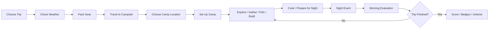

# CampCraft: Wilderness Adventure
## Game Design Document

**Genre:** Educational Camping Simulation / Adventure  
**Primary Platform:** Android  
**Audience:** Young players and families  
**Core Design Goal:** Create a visually rich camping game that teaches practical outdoor, STEM, environmental, financial, and problem-solving skills primarily through interaction and consequence—not reading.

---

# 1. High-Level Concept

**CampCraft: Wilderness Adventure** is a colorful, highly interactive camping simulation where the player plans trips, packs gear, selects campsites, sets up shelter, builds fires, prepares food, purifies water, explores trails, fishes, observes wildlife, manages weather, and improves outdoor skills across increasingly challenging environments.

The game should feel first like a **fun camping adventure** and second like an educational product.

The player should learn by doing:

- Put a tent in a bad place → rainwater pools around it.
- Forget a rain fly → the sleeping bag gets wet.
- Leave food unsecured → raccoons get into camp.
- Throw a huge log on weak tinder → the fire goes out.
- Bring too little water → thirst becomes a problem.
- Overspend on luxury gear → essential equipment may be missing.
- Leave trash behind → the nature score drops.

The game should avoid long explanations. Most teaching should occur through:

**Action → Visual consequence → Quick feedback → Retry → Mastery**

---

# 2. Design Pillars

## 2.1 Visual First

The game should communicate information primarily through:

- Environment changes
- Animation
- Character reactions
- Icons
- Color-coded meters
- Sound cues
- Object states
- Short labels
- Demonstration

Long text boxes should be rare.

### Rule
> Never explain something in a paragraph if the player can understand it by seeing it happen.

## 2.2 Learn Through Consequences

Players should be allowed to make mistakes. Wrong choices should normally create a funny consequence, a temporary setback, a visible environmental change, or a chance to correct the problem.

Avoid harsh punishment. The goal is experimentation.

## 2.3 Real Camping Logic, Simplified

Use real-world concepts while simplifying them enough to remain playable:

- Fire requires fuel, heat, and oxygen.
- Campsites should be flat, dry, and reasonably elevated.
- Clear-looking water may still need treatment.
- Wet wood burns poorly.
- Food should be secured from wildlife.
- Weather changes camping needs.
- Clothing affects comfort.
- Poor preparation creates problems.

The game is not intended to replace real outdoor safety instruction.

## 2.4 Short Sessions, Long-Term Progression

A single camping day should be playable in roughly 5–15 minutes. A full trip may span multiple game days.

Progress persists through:

- Badges
- Gear
- Campsites
- Skills
- Discoveries
- Fish caught
- Wildlife observed
- Camp upgrades
- Player journal
- Challenge completion

---

# 3. Player Fantasy

The player should feel like:

- A camper
- An explorer
- A builder
- A problem solver
- A nature observer
- A survival planner
- A camp chef
- A fisherman
- A junior engineer

The player should **not** feel like they are completing school assignments.

---

# 4. Visual Art Direction

## 4.1 Overall Style

Use a polished **stylized 3D or 2.5D diorama aesthetic**.

The tone should be:

- Cozy
- Colorful
- Warm
- Slightly exaggerated
- Highly readable
- Nature-rich
- Toy-like but not babyish

The campsite should look like an interactive miniature world.

### Recommended Camera

Use an **isometric or elevated 3/4 view**.

Benefits:

- Easy object placement
- Strong campsite readability
- Good visibility of terrain
- Attractive screenshots
- Natural drag-and-drop interaction
- Easy transition between camp and exploration

## 4.2 World Presentation

The environment should feel alive even when the player is idle.

Include:

- Moving tree branches
- Grass motion
- Butterflies
- Birds
- Flowing water
- Fireflies at night
- Smoke from campfires
- Clouds
- Dynamic shadows
- Rain splashes
- Puddles
- Stars
- Moonlight
- Animal tracks
- Fish movement beneath water

## 4.3 Day/Night Cycle

### Morning
- Cool sunlight
- Dew
- Birds
- Light mist
- Long shadows

### Midday
- Bright sunlight
- High visibility
- Strong nature colors

### Evening
- Golden-hour lighting
- Long shadows
- Campfire emphasis
- Warmer tones

### Night
- Deep blue environment
- Lantern glow
- Campfire light
- Stars
- Fireflies
- Moonlight

Night should feel magical rather than frightening.

## 4.4 Weather Presentation

Weather must be strongly visual.

### Rain
- Clouds roll in
- Light dims
- Rain droplets
- Water pools in low areas
- Gear becomes visibly wet
- Tent fabric darkens

### Wind
- Trees sway
- Loose objects move
- Tent walls ripple
- Smoke direction changes

### Cold
- Character shivers
- Visible breath
- Frost
- Warm clothing becomes visibly important

### Heat
- Strong sunlight
- Character wipes forehead
- Water meter falls faster
- Shade becomes valuable

### Storm
- Dark clouds
- Lightning flashes
- Heavy rain
- Strong wind
- Urgent audio

---

# 5. Character Design

The player controls a customizable camper avatar.

Customization can include:

- Hair
- Skin tone
- Shirts
- Jackets
- Hats
- Backpacks
- Shoes
- Outdoor accessories

The character should be expressive.

Instead of text warnings, use reactions:

- Hungry → holds stomach
- Cold → shivers
- Hot → wipes forehead
- Tired → yawns
- Wet → shakes off water
- Happy → celebrates
- Bad smell → waves hand near nose
- Fish caught → jumps excitedly

Character animation is part of the teaching system.

---

# 6. Core HUD

Keep the main screen visually clean.

## Primary Status Meters

| Icon | System |
|---|---|
| ❤️ | Health |
| 🍗 | Hunger |
| 💧 | Thirst |
| 🌡️ | Temperature Comfort |
| ⚡ | Energy |
| 😊 | Morale |

Meters should be icon-heavy and readable without text.

### Contextual Alerts

Examples:

- 💧⬇️
- 🌡️🥶
- 🔥❌
- 🏕️💧
- 🦝🍪
- ⛈️⚠️

Tapping an alert can reveal a short explanation if needed.

---

# 7. Core Gameplay Loop



---

# 8. Trip Selection

Trips are selected from a visual map.

Each destination shows:

- Environment
- Difficulty
- Number of days
- Weather tendency
- Major activities
- Main learning theme

Example:

### Pine Lake Campground
🏕️ Easy  
🌤️ Mild Weather  
🎣 Fishing  
🔥 Campfire Basics  
**2 Days**

### Whispering Woods
🏕️🏕️ Medium  
🌧️ Variable Weather  
🧭 Navigation  
🐾 Wildlife  
**3 Days**

### Eagle Ridge
🏕️🏕️🏕️ Hard  
🥶 Cold Nights  
⛰️ Elevation  
💧 Water Management  
**4 Days**

---

# 9. Progression Map

## Stage 1 — Backyard Camp

Focus:
- Packing
- Tent basics
- Flashlight
- Sleeping gear
- Simple food

Low risk.

## Stage 2 — Developed Campground

Focus:
- Campfire
- Cooking
- Cleanup
- Basic water
- Campsite organization

## Stage 3 — Lakeside Camp

Focus:
- Fishing
- Water treatment
- Wildlife
- Weather

## Stage 4 — Forest Camp

Focus:
- Navigation
- Trail exploration
- Animal tracks
- Wood collection

## Stage 5 — Mountain Camp

Focus:
- Temperature
- Wind
- Layering clothing
- Storm preparation

## Stage 6 — River Camp

Focus:
- Water behavior
- Site elevation
- Flood awareness
- Bridge and crossing challenges

## Stage 7 — Wilderness Expedition

Combines all systems with minimal guidance.

---

# 10. Pre-Trip Packing Game

Before each trip, the player packs using a visual backpack grid.

## Example Gear

- Tent
- Sleeping bag
- Ground tarp
- Rain fly
- Water bottles
- Water filter
- Food
- Flashlight
- First-aid kit
- Fishing rod
- Compass
- Map
- Rain jacket
- Warm clothing
- Rope
- Cooking pot
- Fire starter
- Hatchet
- Book
- Camera
- Snacks
- Camp chair

Each item uses limited backpack space. The player cannot take everything.

### Educational Concepts

- Prioritization
- Planning
- Needs vs. wants
- Weight
- Space
- Preparation
- Budgeting

---

# 11. Outdoor Store & Budgeting

Before some trips, the player receives a camping budget.

Example:

**Budget: $150**

| Item | Price |
|---|---:|
| Tent | $50 |
| Sleeping Bag | $30 |
| Flashlight | $15 |
| Food | $25 |
| Fishing Rod | $30 |
| Camp Chair | $40 |
| Water Filter | $35 |

The player chooses what to buy. Luxury purchases can create later consequences.

Example: buy a fancy chair instead of a water filter. Later the player finds stream water but must boil it because no filter was purchased.

---

# 12. Campsite Selection

When arriving, the player sees several possible tent locations.

The player physically taps a location.

Terrain characteristics include:

- Flatness
- Slope
- Elevation
- Distance from water
- Tree cover
- Mud
- Roots
- Rocks
- Exposure to wind

The game should not immediately reveal the correct answer.

### Example Consequences

**Low area:** rainwater pools.  
**Steep area:** sleeping bag slides downhill.  
**Too close to water:** flooding risk and more insects.  
**Dead branch overhead:** unsafe-location warning.  
**Ideal site:** flat, dry, stable, reasonably sheltered.

---

# 13. Tent Setup Mini-Game

The player builds the tent visually.

## Sequence

1. Clear obvious debris
2. Place ground tarp
3. Position tent
4. Assemble poles
5. Insert poles
6. Stake corners
7. Add rain fly
8. Tighten guy lines

### Interaction

Use mostly:

- Drag
- Drop
- Rotate
- Tap
- Pull

The tent visibly changes as each step is completed.

### Failure Examples

**No stakes:** 💨 tent shifts during wind.  
**No rain fly:** 🌧️ water enters.  
**Poorly tightened lines:** 🏕️ tent sags.  
**No ground tarp:** 💧 floor becomes damp.

---

# 14. Camp Organization

The player arranges the campsite.

Possible zones:

- Sleeping
- Fire
- Cooking
- Food storage
- Gear storage
- Trash
- Washing
- Recreation

Objects can be dragged around camp.

Poor organization creates problems.

Examples:

- Food beside tent → 🦝 wildlife visits sleeping area.
- Trash near cooking area → 🐜 insects gather.
- Fire too close to tent → 🔥 warning.

---

# 15. Fire Building

Fire building should be a major interactive system.

## Materials

### Tinder
- Dry grass
- Bark
- Cotton starter
- Pine needles

### Kindling
- Tiny sticks
- Small twigs

### Fuel
- Small wood
- Medium wood
- Logs

The player builds the fire physically.

### Fire Logic

```text
Tinder
  ↓
Kindling
  ↓
Small Wood
  ↓
Larger Wood
```

The fire requires:

- Heat
- Fuel
- Oxygen

### Visual Feedback

**Healthy fire:** 🔥 bright flame  
**Poor oxygen:** 💨 smoky weak flame  
**Wet wood:** 💦🪵 hiss + smoke  
**Too-large log:** 🔥⬇️ flame collapses

---

# 16. Fire Safety

Before leaving camp or sleeping, the fire must be handled.

Use visual actions:

💧 Water  
🪣 Stir  
✋ Check heat

Unsafe behavior should produce clear consequences.

Example: player leaves glowing embers. Wind increases. Embers brighten and the game signals danger.

---

# 17. Water System

Water sources:

- Packed water
- Campground faucet
- Stream
- River
- Lake
- Collected rainwater

Natural water should generally require treatment.

## Treatment Methods

### Filter
Water passes through a visible filter.

### Boiling
Water must reach a full boil.

### Treatment Drops/Tablets
Add → wait timer → safe.

Teach the concept:

**Clear ≠ automatically safe**

through visuals and consequences rather than lengthy explanation.

---

# 18. Cooking System

Cooking should use short tactile mini-games.

Foods might include:

- Hot dogs
- Fish
- Beans
- Soup
- Eggs
- Corn
- Potatoes
- Marshmallows
- Pancakes

## Cooking Meter

```text
RAW ───── SAFE ───── BURNT
```

The player manages heat and timing.

### Additional Concepts

- Measuring
- Portions
- Temperature
- Timing
- Cleanliness
- Food storage

---

# 19. Fishing System

Fishing should be a relaxing skill activity.

## Gameplay

1. Choose bait/lure
2. Cast
3. Watch bobber
4. Hook fish
5. Reel without breaking line
6. Identify catch
7. Keep or release

Fish species can include:

- Bluegill
- Bass
- Catfish
- Trout
- Crappie

Different species favor different depths, baits, times of day, and locations.

---

# 20. Nature Discovery

The player can discover:

- Birds
- Mammals
- Reptiles
- Amphibians
- Fish
- Insects
- Trees
- Flowers
- Mushrooms
- Rocks
- Tracks

Discoveries fill a visual field guide.

## Field Guide Entry Example

### White-tailed Deer

🦌

Habitat: 🌲🌾  
Food: 🌿  
Active: 🌅🌇

Use icons and short phrases. Avoid encyclopedia-length descriptions.

---

# 21. Wildlife Encounters

Wildlife should usually be observation-based rather than combat-based.

Examples:

- Deer
- Squirrel
- Raccoon
- Fox
- Owl
- Rabbit
- Snake
- Bear

### Example: Raccoon

Food left unsecured.

At night:

🦝 → cooler → food scattered.

Player learns food storage.

### Example: Deer

Player approaches quickly:

🦌💨

Player approaches quietly:

📸 successful observation.

---

# 22. Navigation

The exploration map should use real directional concepts.

Tools:

- Compass
- Map
- Trail markers
- Landmarks

Early mission:

> Find the lake northeast of camp.

Later mission:

> Follow the creek west until it meets the trail.

The player learns directions through movement.

---

# 23. Exploration Mode

The player can leave the campsite and explore connected areas.

Possible destinations:

- Lake
- Creek
- Meadow
- Waterfall
- Ridge
- Cave entrance
- Fishing dock
- Nature trail
- Ranger station

Exploration should be visually rewarding.

Players can discover:

- Hidden fishing spots
- Wildlife
- Collectibles
- Scenic viewpoints
- Materials
- Mini-games

---

# 24. Weather Forecast System

Before the day begins, show a visual forecast.

Example:

**Today:** ☀️ 72°  
**Evening:** 🌧️ 61°  
**Night:** 🌧️💨 52°

Weather changes:

- Clothing needs
- Water consumption
- Fire difficulty
- Tent requirements
- Trail conditions
- Wildlife activity

---

# 25. Temperature & Clothing

Clothing items provide warmth and weather protection.

Examples:

- T-shirt
- Hoodie
- Jacket
- Rain shell
- Hat
- Warm socks

The player character visually changes clothing.

If overdressed: 🥵  
If underdressed: 🥶

The temperature meter responds.

---

# 26. First Aid

Use simple, age-appropriate scenarios.

Possible events:

- Small cut
- Scrape
- Bug bite
- Sunburn
- Mild dehydration
- Minor cooking burn

Example:

Character gets a small cut.

Choices appear as icons:

🧼 Clean  
🩹 Bandage  
🤷 Ignore

Appropriate care improves recovery.

---

# 27. Engineering Challenges

Camping naturally supports STEM challenges.

## Rain Shelter

Player receives:

- Tarp
- Rope
- Trees/poles

They must create a shelter that sheds water.

Bad design:

```text
\____/
```

Water pools.

Better design:

```text
 /\
```

Water runs off.

## Simple Bridge

Cross a small creek using logs, boards, and rope. The bridge must support weight.

## Cooking Tripod

Construct a tripod using three poles, rope, and a hook. Use it to hold a pot above fire.

## Wood Rack

Keep firewood off wet ground. The next rainstorm demonstrates whether the design works.

---

# 28. Leave No Trace System

Every trip receives a **Nature Score**.

Positive actions:

- Pick up trash
- Extinguish fire
- Respect wildlife
- Stay on trails
- Pack out waste
- Avoid damaging plants

Negative actions:

- Leave trash
- Damage vegetation
- Leave fire burning
- Chase wildlife
- Pollute water

Final score presentation:

🌲 Nature: ⭐⭐⭐⭐⭐  
🔥 Fire Safety: ⭐⭐⭐⭐  
🗑️ Cleanliness: ⭐⭐⭐⭐⭐  
🐾 Wildlife Respect: ⭐⭐⭐⭐⭐

---

# 29. Daily Cycle

## Morning

Quick status check:

- Weather
- Hunger
- Water
- Energy

Potential tasks:

- Cook breakfast
- Refill water
- Check firewood
- Plan hike

## Day

Primary activity period:

- Explore
- Fish
- Gather
- Build
- Photograph wildlife
- Complete challenges

## Evening

Preparation phase:

- Cook dinner
- Secure food
- Refill water
- Prepare fire
- Check weather
- Organize camp

## Night

Short event:

- Raccoon
- Rain
- Wind
- Owl sighting
- Cold snap
- Clear starry night

Preparation determines outcome.

---

# 30. Night Events

## Raccoon Raid

**Trigger:** food unsecured.  
**Result:** food loss + funny animation.

## Sudden Rain

**Trigger:** forecast indicated rain.  
**Outcome depends on:** rain fly, tent location, and gear storage.

## Cold Night

**Trigger:** temperature drop.  
**Outcome depends on:** sleeping bag, clothes, and preparation.

## Perfect Night

Good preparation creates:

🔥 glowing fire  
🌌 stars  
🦉 owl call  
😊 relaxed camper

Bonus morale and XP.

---

# 31. Failure Philosophy

Avoid traditional **GAME OVER** screens where possible.

Instead:

**Failure creates a problem to solve.**

Examples:

- Tent floods → move tent + dry gear.
- Fire goes out → rebuild it.
- Food gets stolen → use backup food or catch fish.
- Player gets too cold → return to shelter.
- Low water → purify more.

This promotes experimentation.

---

# 32. Educational Feedback

Use three layers.

## Layer 1 — Visual

Immediate consequence.

Example: tent fills with water.

## Layer 2 — Icon

🏕️💧

## Layer 3 — Optional Short Explanation

Tap icon:

> Low ground collects rainwater.

The explanation should usually be one sentence maximum.

---

# 33. Reading Limits

This is a **critical game requirement**.

## Recommended Limits

Routine prompt: **3–8 words**  
Tutorial: **Under 12 words**  
Pop-up explanation: **One short sentence**  
Mission goal: **One sentence**

Avoid multi-paragraph dialogue.

If a concept requires explanation, prefer:

- Animation
- Diagram
- Demonstration
- Icon
- Voice-over
- Interactive example

---

# 34. Audio Design

Audio should strongly support immersion.

## Ambient Sounds

Forest:
- Birds
- Wind
- Leaves

Lake:
- Water
- Frogs
- Insects

Night:
- Crickets
- Owls
- Fire crackling

Rain:
- Tent fabric
- Water drops
- Thunder

## Interaction Sounds

- Backpack zip
- Tent stake hit
- Fishing reel
- Fire ignition
- Water splash
- Cooking sizzle
- Compass click
- Badge unlock

Sound should make interactions satisfying.

---

# 35. Music Direction

Music should be light and atmospheric.

Recommended feel:

- Acoustic guitar
- Soft percussion
- Whistle
- Light strings
- Ambient nature textures

Music intensity can change during exploration, storms, night, and successful challenges.

Do not let music overpower environmental sounds.

---

# 36. Animation & Juice

Visual polish is a major product requirement.

Small actions should feel satisfying.

Examples:

### Fire
- Sparks
- Embers
- Smoke
- Glow

### Fishing
- Rod bends
- Water splashes
- Fish jumps

### Tent
- Fabric snaps into shape
- Poles flex

### Badges
- Pop animation
- Particles
- Sound

### Character
- Celebrates success
- Reacts humorously to mistakes

---

# 37. Badges

Badges replace grades.

Examples:

🏕️ **Camp Builder** — Set up five tents correctly.  
🔥 **Fire Starter** — Build five successful fires.  
💧 **Water Wise** — Safely prepare water ten times.  
🎣 **Angler** — Catch ten fish.  
🧭 **Trail Finder** — Complete five navigation missions.  
🌲 **Forest Guardian** — Earn five perfect Nature Scores.  
🍳 **Camp Chef** — Cook ten meals.  
⛈️ **Storm Ready** — Successfully prepare for a storm.  
🐾 **Wildlife Tracker** — Discover twenty animals.  
🔨 **Camp Engineer** — Complete five building challenges.

---

# 38. Skill Progression

Skills level through use.

Possible skills:

- Camping
- Firecraft
- Fishing
- Navigation
- Cooking
- Nature
- Engineering
- First Aid
- Weather
- Budgeting

Progress unlocks:

- New challenges
- New gear
- Cosmetic rewards
- New campsites

Avoid stat grinding.

---

# 39. Adaptive Difficulty

The game quietly tracks performance.

If the player repeatedly succeeds:

- Remove hints
- Add harder weather
- Introduce more gear choices
- Increase navigation complexity
- Add more realistic fire conditions

If the player struggles:

- Highlight relevant objects
- Slow timers
- Show directional arrows
- Provide demonstration animations

Never label the player as being on an easier mode.

---

# 40. Sample Missions

## Mission: First Night Out

**Environment:** Backyard

Goals:

🏕️ Set up tent  
🎒 Put sleeping bag inside  
🔦 Pack flashlight  
🌙 Sleep through night

Learning: basic camping setup.

## Mission: Rain Is Coming

**Environment:** Campground  
**Forecast:** 🌧️ Tonight

Goals:

🏕️ Pick dry tent location  
☔ Install rain fly  
🎒 Store gear  
🔥 Protect firewood

Learning: weather preparation.

## Mission: Dinner at the Lake

**Environment:** Lake

Goals:

🎣 Catch fish  
🔥 Build fire  
🍳 Cook fish  
🗑️ Clean site

Learning: fishing, cooking, cleanup.

## Mission: Where Did the Food Go?

**Environment:** Forest

Setup: player previously left food out.

Night: raccoon raid.

Next objective:

🔒 Create secure food storage.

Learning: wildlife-safe camp management.

## Mission: Lost Trail

**Environment:** Forest

Goals:

🧭 Use compass  
🗺️ Follow map  
🌲 Identify landmarks  
🏕️ Return to camp

Learning: navigation.

## Mission: Storm Night

**Environment:** Mountain

Goals:

⛈️ Read forecast  
🏕️ Secure tent  
🪵 Store dry wood  
🧥 Dress warmly  
🍲 Prepare food  
🔥 Safely manage fire

Learning: integrated preparation.

---

# 41. Main Screens

## 41.1 Home Screen

Visual: camper beside campfire.

Buttons:

▶ Continue  
🗺️ Trips  
🎒 Gear  
🏅 Badges  
📖 Field Guide  
⚙️ Settings

## 41.2 Trip Map

Interactive map showing unlocked destinations.

Each location is represented visually. Avoid text lists.

## 41.3 Outdoor Store

Visual shelf layout.

Tap an item to see:

- Price
- Weight
- Function icon

## 41.4 Packing Screen

Backpack grid.

Drag gear into backpack.

Indicators:

⚖️ Weight  
📦 Space  
💰 Cost

## 41.5 Campsite Screen

Primary gameplay screen.

Large environment with a minimal HUD.

Bottom toolbar:

🎒 Inventory  
🛠️ Build  
🗺️ Explore  
🍳 Cook  
🔥 Fire  
📖 Guide

## 41.6 Exploration Screen

Trail/world map where the player moves between local locations.

## 41.7 End-of-Day Screen

Keep it very visual.

Example:

🌲 Nature ⭐⭐⭐⭐⭐  
🔥 Safety ⭐⭐⭐⭐  
🍳 Food ⭐⭐⭐  
😊 Comfort ⭐⭐⭐⭐⭐

Then show discoveries and unlocked items.

---

# 42. Interaction Language

Primary interactions:

### Tap
Select object.

### Drag
Move or place object.

### Swipe
Rotate camera or browse inventory.

### Hold
Inspect.

### Pinch
Zoom.

Avoid complicated control combinations.

---

# 43. Iconography

Use consistent icons throughout the game.

🏕️ Shelter  
🔥 Fire  
💧 Water  
🍗 Food  
🧭 Navigation  
🎣 Fishing  
🌲 Nature  
🐾 Wildlife  
🛠️ Building  
🎒 Gear  
🌡️ Temperature  
💰 Money  
🩹 Health  
⛈️ Weather

Use both icon and optional label until players learn the system.

---

# 44. Accessibility

Support:

- Large touch targets
- Color + icon communication
- Adjustable text size
- Optional narration
- Reduced motion
- Sound captions
- High-contrast mode
- Simplified control mode

Important information must not depend only on color.

---

# 45. Child-Friendly Product Rules

Avoid manipulative systems.

Recommended:

- No advertisements
- No loot boxes
- No gambling-style mechanics
- No energy timers requiring payment
- No artificial waiting designed to drive purchases
- No pressure-based monetization

If monetized, prefer:

- One-time purchase
- Family purchase
- Optional expansion packs

---

# 46. Save System

Automatically save:

- Gear
- Unlocked locations
- Badges
- Skills
- Field guide
- Current trip
- Campsite state
- Discoveries

Trips should resume exactly where the player stopped.

---

# 47. Game State Model

A generator or developer should track at minimum:

```yaml
player:
  health:
  hunger:
  thirst:
  temperature:
  energy:
  morale:
  money:

skills:
  camping:
  firecraft:
  fishing:
  navigation:
  cooking:
  nature:
  engineering:
  first_aid:
  weather:
  budgeting:

inventory:
  - item_id
  - quantity
  - condition

trip:
  location:
  day:
  time_of_day:
  weather:
  forecast:
  objectives:

camp:
  tent_location:
  tent_setup_quality:
  fire_state:
  water_supply:
  food_storage:
  trash_state:
  firewood_dryness:
  cleanliness:

discoveries:
  wildlife: []
  plants: []
  fish: []
  landmarks: []

progress:
  badges: []
  unlocked_locations: []
  completed_missions: []
```

---

# 48. Content Object Model

Each interactable object should contain data similar to:

```yaml
object_id: wet_log_01
name: Wet Log
category: firewood

properties:
  fuel_value: 70
  moisture: 85
  ignition_difficulty: high

visual_states:
  dry:
  wet:
  burning:
  charred:

interactions:
  - inspect
  - pick_up
  - place_in_fire

educational_concept:
  wet_wood_burns_poorly
```

This allows a game generator to connect educational concepts directly to gameplay states.

---

# 49. Event System

Events can be triggered by player choices and world conditions.

Example:

```yaml
event_id: raccoon_food_raid

requirements:
  time_of_day: night
  food_secured: false
  wildlife_region: true

result:
  lose_food: 2
  morale: -5
  unlock_lesson: food_storage

visual:
  animation: raccoon_opens_cooler
```

---

# 50. Weather Event Example

```yaml
event_id: night_rain

requirements:
  weather: rain

checks:
  tent_has_rainfly:
  tent_location_drainage:
  gear_stored:

outcomes:
  excellent:
    morale: +5

  partial:
    energy: -5

  poor:
    sleeping_bag_wet: true
    morale: -10
```

---

# 51. Educational Design Framework

Each educational concept should follow this pattern:

```text
PLAYER ACTION
      ↓
VISIBLE SYSTEM RESPONSE
      ↓
SHORT FEEDBACK
      ↓
PLAYER ADJUSTS
      ↓
SUCCESS
      ↓
CONCEPT REINFORCED LATER
```

Example:

Player places tent in low area.  
↓  
Rain begins.  
↓  
Water pools.  
↓  
🏕️💧  
↓  
Player moves tent.  
↓  
Later campsite requires choosing elevated ground.

This is preferable to a quiz.

---

# 52. Reward System

Reward:

- Exploration
- Preparation
- Good judgment
- Experimentation
- Environmental responsibility
- Skill mastery

Possible rewards:

- Badges
- New backpacks
- Tents
- Fishing rods
- Clothing
- Campsite decorations
- New destinations
- Field guide entries

Avoid rewards based primarily on repetitive grinding.

---

# 53. Campsite Customization

Allow cosmetic personalization.

Examples:

- Tent colors
- Sleeping bags
- Lantern styles
- Camp chairs
- Flags
- Cooler designs
- Backpacks
- Camping mugs

This gives progression emotional value without affecting learning balance.

---

# 54. Replayability

Trips should vary through:

- Weather
- Wildlife
- Fish
- Events
- Campsite conditions
- Optional objectives
- Gear choices

The same campground should not play identically every time.

---

# 55. Example Five-Minute Gameplay Sequence

1. Player arrives at lake campground.
2. Picks a tent location.
3. Drags tent onto ground.
4. Builds tent.
5. Weather icon changes to 🌧️.
6. Player adds rain fly.
7. Goes fishing.
8. Catches bluegill.
9. Returns to camp.
10. Builds fire.
11. Cooks fish.
12. Stores leftover food.
13. Rain begins.
14. Tent stays dry.
15. Raccoon walks through camp but cannot reach food.
16. Player receives:

🏕️ Dry Camp  
🦝 Wildlife Wise  
🌧️ Weather Ready

Almost no reading is required.

---

# 56. Long-Term Vision

CampCraft can eventually become a broad outdoor-learning platform.

Future expansion packs could include:

## CampCraft: Mountains
- Elevation
- Cold
- Hiking

## CampCraft: Rivers
- Currents
- Fishing
- Water systems

## CampCraft: Desert
- Heat
- Water conservation
- Navigation

## CampCraft: Winter
- Snow
- Insulation
- Cold-weather shelter

## CampCraft: Junior Ranger
- Ecology
- Conservation
- Wildlife identification

The same core engine can support all of these.

---

# 57. Final Product Vision

The final game should feel like:

> **A beautiful interactive camping world where curiosity naturally teaches real skills.**

The player should rarely feel that the game is asking:

> “Do you know the answer?”

Instead, it should ask:

> “What do you want to try?”

The environment provides the answer.

That is the core identity of **CampCraft: Wilderness Adventure**.

---

# 58. Non-Negotiable Development Rules

1. **Visuals come before text.**
2. **No long dialogue boxes.**
3. **Most instructions stay under one sentence.**
4. **Every major concept should have a visible consequence.**
5. **Mistakes should be recoverable.**
6. **The environment should always feel alive.**
7. **Educational content must serve gameplay.**
8. **No forced quiz gates unless the mechanic itself naturally requires knowledge.**
9. **Rewards should emphasize mastery and exploration.**
10. **The game must remain fun even if the player ignores the educational intent.**
